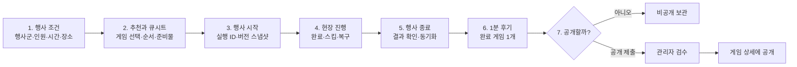

# 레크플러스 다음 개발 제품 결정문

> 결정 주제: 행사 진행 기록과 선택적 구조화 후기를 연결하는 제한 파일럿  
> 상태: **확정**  
> 기준일: 2026-09-11  
> 적용 범위: `web/` 제품과 Supabase 데이터 계약  
> 이 문서는 기존 로드맵과 Astra 검토를 통합한 제품 및 개발 착수 기준이다. 기존 문서와 충돌하면 이 문서를 우선한다.

---

## 0. 결정 요약

레크플러스의 다음 목표는 **‘검증된 아카이브 출시’가 아니라, ‘행사별 진행 기록과 선택적 후기를 손실 없이 연결하는 제한 파일럿’**이다.

제품의 순서는 다음으로 고정한다.

1. 신뢰할 수 있는 행사 실행 기록을 만든다.
2. 실행 기록과 연결된 짧은 후기를 검수해 게임에 붙인다.
3. 상황별로 반복 관찰된 사실만 운영 자료로 요약한다.
4. 반복 수요가 확인된 준비물·공유·BGM·팀 업무만 확장한다.
5. 광고·제휴·유료화는 사용량과 지불 의사가 확인된 뒤 따로 판단한다.

기간은 개발 일정을 예측하는 데만 쓴다. **다음 단계 진입은 날짜가 아니라 데이터 무결성, 실사용, 운영 수용 능력으로 결정한다.**

---

## 1. 최종 제품 포지션

### 1.1 레크플러스가 무엇인가

**레크플러스는 행사 조건에 맞는 게임을 고르고, 큐시트로 준비·진행하며, 그 결과 기록과 검수된 후기를 다음 행사의 판단 자료로 돌려주는 진행자용 운영 도구다.**

핵심 가치는 게임 개수가 아니라 다음 순환이다.

` 행사 조건 → 추천 → 큐시트 → 현장 진행 → 행사별 기록 → 게임 후기 → 다음 선택 근거 `

### 1.2 레크플러스가 아닌 것

- 참가자가 가입하고 관계를 맺는 SNS가 아니다.
- 독립 게시판·댓글·팔로우를 중심으로 한 커뮤니티가 아니다.
- 행사가 실제로 열렸거나 성공했음을 인증하는 서비스가 아니다.
- 학교·회사·아동·신체 활동의 안전성을 인증하는 기관이 아니다.
- 저장·완료 클릭·별점을 품질 진실로 바꾸는 평판 시스템이 아니다.

### 1.3 사용자에게 보여줄 포지션 문구

장기 비전인 ‘실제 행사 결과로 검증되는 운영 아카이브’는 파일럿 홍보 문구로 쓰지 않는다. 1·2단계에서는 다음처럼 설명한다.

> **진행 기록과 연결된 후기를 모아, 다음 행사를 준비할 때 참고할 수 있는 운영 자료를 만듭니다.**

게임 후기 배지는 다음으로 고정한다.

> **진행 기록 연결 후기**  
> 레크플러스에 저장된 진행 기록에서 작성된 후기입니다. 기록 연결은 행사의 성공·안전을 보증하지 않습니다.

### 1.4 공통 행사 조건 체계

학교·대학·회사·소규모 모임은 서로 배타적인 하나의 분류로 취급하지 않는다. 행사를 다섯 개 축으로 표현한다.

| 축 | 1차 저장 값 | 입력·공개 규칙 |
|---|---|---|
| 행사군 | 학교 / 대학 / 회사 / 사적 모임·기타 | 필수. 조직명은 받지 않음 |
| 규모 | 실제 인원, 파생 인원 구간 | 정확한 인원은 비공개 기록, 공개는 구간만 사용 |
| 시간 | 목표 행사 시간, 게임별 배정 시간 | 행사 생성 시 필수. 실제 소요는 실행 기록에 분리 |
| 장소 | 교실·실내 / 식당·주점 / 강당·대형 실내 / 차량 / 야외 / 기타 | 필수. 공개는 범주만 사용 |
| 제약 | 신체접촉 제외, 저소음, 이동 최소화, 준비물 제한, 음주 없음 등 | 선택. 메타데이터에 근거가 없으면 `없음`이 아니라 `미확인` |

행사 유형(MT·OT·워크숍·회식 등)은 선택입력으로 두고, 추천 필수조건으로 쓰지 않는다. 1차 추천은 행사군·인원·시간·장소와 사용자가 명시한 제약으로 작동한다.

---

## 2. 1차 제한 파일럿 범위

### 2.1 파일럿 목표

> **운영자가 기존 큐시트로 행사를 진행하고, 행사별 결과를 보존하며, 실제로 완료한 게임 하나의 구조화 후기를 선택적으로 제출하고, 관리자가 검수해 게임 상세에 공개할 수 있다.**

### 2.2 반드시 포함할 기능

#### 기록과 진행

- 행사군·정확한 인원·목표 시간·장소·선택 제약을 하나의 조건 체계로 저장한다.
- 행사 플랜과 행사 실행을 분리하고, 같은 큐시트 재진행 시 매번 새 실행 ID를 만든다.
- 행사 시작 시점의 플랜, 플랜 항목, 게임 버전, 행사 조건을 스냅샷으로 고정한다.
- 게임별 `pending → playing → completed / skipped`를 저장하고, 결과를 바꾸는 주요 동작만 이벤트로 보존한다.
- 행사 종료는 현재 게임을 자동 완료하지 않는다. 완료·스킵 결과를 확인한 뒤 별도 종료 동작을 한다.
- 종료 후 일반 덮어쓰기를 금지하고, 정정은 사유와 이력을 남긴다.
- 오프라인에서는 `기기에 저장됨 · 동기화 대기`를 보이고, 재연결 후 고유 요청 ID로 멱등 재전송한다.
- 기존 로컬 큐시트·세션은 계정별 저장 공간으로 분리하고, 로그아웃 후 다른 계정에 노출·자동 업로드되지 않게 한다.

#### 저장·후기·공개

- 저장한 게임은 하나의 목록만 제공하고, 큐시트 추가로 연결한다.
- 행사 종료 후 서버에 동기화된 `completed` 게임 중 하나를 골라 1분 후기를 쓴다.
- 완료 기준을 넘지 못한 행사도 기록을 남기고, 완료한 게임이 있다면 그 게임에 후기를 남길 수 있다.
- 후기는 `행사 실행 ID + 게임 버전 ID`당 하나다. 스킵만 한 게임과 타인의 행사는 자격이 없다.
- 입력은 `결과(잘 맞음/조건부/맞지 않음)`, `재사용 의향(있음/없음/모르겠음)`을 필수로 받는다.
- 실제 소요시간은 선택이며 `모름`을 허용한다. 콘솔 측정 시간과 작성자 입력 시간을 다른 필드로 저장한다.
- 문제 태그는 초기 고정 목록으로 제한한다: 시간 불일치, 규칙 이해 어려움, 참여 저조, 소음, 신체접촉, 준비물, 기술 문제, 기타.
- 진행 팁은 선택이고 200자로 제한한다.
- 후기는 기본 `private`이다. `공개 제출`을 별도로 선택해야 `pending`이 된다.
- 공개 동의는 가입 동의와 분리하고 동의 문서 버전·시각·신청 본문을 보존한다.
- 후기 공개는 `pending → published / changes_requested / rejected`로 검수한다. 공개 후 수정은 비공개로 돌린 뒤 재검수하며, 철회는 즉시 비공개다.
- 게임 상세에는 검수된 후기, 공개용 행사 조건, 연결 후기 수, 주의사항만 보여준다. 원본 행사 ID·정확한 인원·내부 검수 메모는 공개하지 않는다.

#### 검수·신고·운영

- 기존 새 게임 제안과 검수 흐름을 유지하되, 작성자가 미검수 콘텐츠를 직접 공개하는 경로를 열지 않는다.
- 후기·게임 제안을 하나의 관리자 대기열에서 필터링하고, 수정 요청·승인/공개·반려·긴급 숨김·복구를 제공한다.
- 공개 콘텐츠에 신고하고 처리 결과와 사유를 보존한다. 신고 횟수만으로 자동 숨김·삭제하지 않는다.
- 제출·수정 요청·승인·공개·숨김·복구·철회는 작업자, 시각, 사유, 편집 버전을 감사 기록으로 남긴다.
- 공개 콘텐츠에는 게임 출처와 작성자 크레딧을 유지한다. 사용자 콘텐츠를 `official`로 바꾸지 않는다.
- 새 게임의 ‘변형 제안’ 전용 흐름과 기여자 프로필은 1차에서 제외한다. 기존 새 게임 제안만 회귀 없이 유지한다.

#### 현장 선행 조건

- 준비물 이름·수량·대체품을 게임 상세와 큐시트에 텍스트로 보여준다. 구매 링크는 없다.
- 시작 전 앱 쉘·현재 큐시트·진행 필수 데이터를 오프라인에서 열 수 있게 한다.
- 진행 중단·새로고침·브라우저 재시작 후 같은 실행을 복구한다.
- 1차는 한 행사에 한 명의 운영자와 주 기기 하나를 원칙으로 한다. 다중 기기 동시 진행은 제공하지 않는다.

### 2.3 명확히 제외할 기능

- 별도 커뮤니티 메뉴, 피드, 게시판, 댓글, 팔로우, DM
- 저장 폴더, 공동 컬렉션, 공동 편집, 다중 기기 실시간 진행
- 별점, 도움됨, 인기 순위, 성공률, 추천 점수 공개
- 기여자 프로필·등급·보상, 아카이브 선정 제도
- 사용자·AI 콘텐츠 자동 승인, 신고 숫자만으로 자동 삭제
- 자동 유사도 판정, 복잡한 검수 담당자 배정
- 행사 보고서, 달력, 시즌 비교, 결과 공유 카드
- 사진·영상 업로드, 참가자 실명·연락처·정확한 행사 일시 수집
- BGM 저장·추출·자동재생, 음원·앨범 이미지·가사 수집
- 구매·결제·배송·가격 추적·제휴 링크
- 소셜 로그인 확대와 일반 공개 가입. SMTP를 검증하지 않는 동안 사전 준비 계정만 사용

### 2.4 기능을 붙일 현재 화면

| 현재 화면 | 붙일 기능 |
|---|---|
| `/create` | 행사군·인원·시간·장소·제약 입력 |
| `/create/result` | 조건 표시, 큐시트 확정, 준비물 요약, 저장 결과 |
| `/cuesheets` | 큐시트별 지난 실행·동기화 상태, `새 행사로 시작` |
| `/play/[id]` | 실행 ID 생성, 완료·스킵, 명시적 종료, 오프라인 대기·복구 |
| `/cuesheets/[planId]/runs/[runId]` | 종료 결과, 완료 판정, 게임 하나의 1분 후기. 새 최상위 메뉴는 추가하지 않음 |
| `/games/[id]` | ‘진행 기록 연결 후기’, 연결 후기 수, 주의사항, 신고 |
| `/account` | 내 후기·공개 상태·수정 요청, 내 제안, 공개 철회 |
| `/games/new` | 기존 새 게임 임시저장·제출 흐름 유지 |
| `/admin` | 게임 제안·후기·신고 대기열, 수정 요청·승인·반려·숨김·복구, 감사 이력 |

### 2.5 별도 커뮤니티를 만들지 않는 이유

1. 파일럿에서 검증할 것은 콘텐츠 소비가 아니라 **현장 진행 기록이 다음 게임 선택에 도움이 되는지**다.
2. 후기와 제안을 게임·행사 맥락에 붙이면 저장·추천·큐시트와 바로 연결된다.
3. 독립 피드는 초기 콘텐츠 부족을 드러내고, 댓글·신고·프로필·순위 운영 범위를 키운며, 좋아요를 실제 진행보다 강한 신호로 잘못 만든다.
4. 기존 상세·큐시트·계정·관리자 화면에 붙이면 새 정보 구조와 학습 비용을 최소화할 수 있다.

### 2.6 첫 파일럿 참여자

첫 모집 대상은 **사전 연락과 운영 피드백이 가능한 성인 대학 행사 운영자 5~10팀**으로 제한한다. 학과 학생회, 동아리 운영진, 대학 행사 스태프가 우선이다.

- 기존 제품의 MT·OT·동아리 사용 맥락과 가장 가깝다.
- 운영자가 성인이므로 미성년자 계정·공개 콘텐츠 동의 문제를 파일럿에서 우선 분리할 수 있다.
- 같은 팀의 재진행을 관찰해야 행사 이력 보존과 반복 가치를 확인할 수 있다.
- SMTP를 실제 검증하기 전까지는 사전 준비된 계정으로만 참여한다.

학교·회사·사적 모임 조건은 데이터 모델에 포함하지만, 첫 파일럿의 모집·성공 지표에는 섞지 않는다. 특히 초·중·고등학교 행사는 성인 교사·운영자 모델, 연령 안내, 삭제·신고 절차를 별도 확인한 뒤 확대한다.

---

## 3. 한 화면으로 정리한 사용자 여정

| 단계 | 사용자가 하는 일 | 제품이 보장해야 할 일 |
|---|---|---|
| 1. 조건 | 행사군·인원·시간·장소를 입력하고 제약을 고른다 | 각 축을 분리 저장하고 미확인과 없음을 구분한다 |
| 2. 준비 | 추천 게임을 고르고 큐시트를 저장한다 | 게임 버전, 순서, 배정 시간, 준비물을 저장한다 |
| 3. 시작 | `행사 시작`을 누른다 | 플랜과 실행을 분리하고 독립 실행 ID와 불변 스냅샷을 만든다 |
| 4. 진행 | 게임을 완료하거나 스킵한다 | 동작별 요청 ID를 저장하고 오프라인에서도 복구한다 |
| 5. 종료 | 결과를 확인하고 행사를 종료한다 | 현재 게임을 임의로 완료하지 않고 서버 저장 상태를 보여준다 |
| 6. 후기 | 완료한 게임 하나를 골라 결과·재사용 의향을 적는다 | 행사·게임 버전·소유권을 서버에서 확인한다 |
| 7. 공개 | 기본인 비공개 보관 또는 별도 공개 제출을 선택한다 | 공개 동의를 따로 받고 검수 전에는 외부에 노출하지 않는다 |
| 8. 검수 | 작성자는 상태와 수정 요청 사유를 확인한다 | 승인·반려·숨김·복구를 버전과 감사 이력으로 남긴다 |

### 3.1 행사 완료 지표 판정

완료 판정은 기록 삭제·후기 작성 허용을 결정하는 상태가 아니라 **내부 북극성 지표의 분자 자격**이다.

- 시작 스냅샷이 1게임: 그 게임을 `completed`
- 2게임 이상: `completed_count >= max(2, ceil(start_game_count * 0.5))`
- 명시적 행사 종료와 서버 동기화 완료
- 연습·테스트 플래그가 없음

분모는 행사 시작 시점의 게임 수로 고정한다. 미종료·중단 행사는 관찰 기간이 지난 뒤 완료율 분모에 포함한다. `finished/aborted`와 `qualifies_for_completion_metric`을 다른 값으로 저장한다.

---

## 4. 신뢰와 표현 원칙

### 4.1 용어별 의미

| 보여주는 상태 | 의미 | 의미하지 않는 것 |
|---|---|---|
| `저장함` | 향후 사용 의도가 있음 | 실제 진행, 만족, 적합성 |
| `진행 기록 있음` | 레크플러스 콘솔의 실행 기록이 서버에 저장됨 | 외부 행사 존재 인증, 성공 증명 |
| `게임 완료` | 운영자가 해당 게임을 완료로 표시함 | 참가자 만족, 안전성, 효과 |
| `진행 기록 연결 후기` | 본인 소유의 동기화된 행사에서 `completed`로 저장된 게임의 후기 | 독립 실사, 제3자 검증, 성공 인증 |
| `검수함` | 공개 정책·개인정보·권리·조작 위험 기준을 통과함 | 내용의 진실성, 품질 우월, 안전 인증 |
| `조건에 맞는 추천` | 입력 조건과 게임 메타데이터가 맞는 순서를 제시함 | 성공률·안전성·최고 품질 보증 |

### 4.2 허용·금지 문구

| 사용 가능 | 사용 금지 |
|---|---|
| `진행 기록과 연결된 후기 8건` | `현장 검증 완료` |
| `20~39명 실내 행사에서 작성된 후기` | `20~39명 행사 성공률 90%` |
| `신체접촉 가능성: 있음/없음/미확인` | `학교 사용 안전`, `회사 안전` |
| `이 조건에서는 참여 유도 방식을 먼저 확인하세요` | `실패 없이`, `100% 성공` |
| `입력한 조건을 기준으로 추천함` | `가장 검증된 추천`, `보장된 베스트` |

‘검수됨’ 배지 가까이에는 `공개 기준을 확인한 콘텐츠입니다. 안전성이나 결과를 보증하지 않습니다.`를 툴팁·도움말로 제공한다.

### 4.3 적은 표본의 공개 기준

1·2단계에서는 공개 순위·성공률·평균 점수를 보여주지 않는다. 공개는 다음으로 제한한다.

- 검수 상태
- 연결 후기 수
- 행사 조건 구간
- 후기의 구조화 결과와 팁
- 구체적 주의사항

집계 비율을 검토할 최소 조건은 **동일한 행사 조건 셀당 자격 있는 실행 30건 이상, 고유 운영자 10명 이상, 8주 이상 관찰**이다. 자기 콘텐츠 사용은 외부 표본에서 분리하고, 중단·미종료를 완료율 분모에 포함하며, 방법과 표본 수를 함께 밝힌다. 이 조건을 만족해도 순위 공개는 자동 결정하지 않고 조작 내성·비교 공정성을 별도 검토한다.

---

## 5. 개발 착수용 제품·데이터 계약

### 5.1 핵심 개념과 불변 조건

| 개념 | 결정 |
|---|---|
| 행사 플랜 | 편집 가능한 미래 계획. `revision`을 두고 오래된 저장을 거부 |
| 플랜 게임 | 순서와 별도의 안정적 항목 ID를 가짐. 순서가 바뀌어도 동일 항목을 추적 |
| 행사 실행 | 큐시트를 재사용할 때마다 새 행 생성. 종료 후 불변, 정정만 이력으로 추가 |
| 행사 게임 | 시작 시점의 게임·버전·순서·배정 시간을 보존. 카탈로그 수정으로 바뀌지 않음 |
| 실행 이벤트 | 시작·게임 상태 변경·종료·정정만 저장. `request_id` 유일, 클라이언트 및 서버 시각 분리 |
| 게임 버전 | 공개된 본문·문항을 덮어쓰지 않고 새 버전 생성. 기존 행사·후기는 당시 버전 참조 |
| 게임 제안 | 공통 카탈로그와 분리. 제출본을 고정하고 승인 전 카탈로그 노출 금지 |
| 후기 | 행사 실행·게임 버전에 연결. 비공개와 공개 제출을 분리 |
| 공개 응답 | 공개 전용 view/RPC/API로 구성. 이메일·내부 메모·신고자·원본 행사 ID·비공개 정답 제외 |

현재 `play_sessions` 행을 `event_plan_id + owner_id`로 덮어쓰는 경로는 실행 이력의 원본이 될 수 없다. 이관 기간에만 복구 상태 어댑터로 유지하고, 새 기록은 반드시 행사 실행 원본에 쓴다.

### 5.2 데이터 구조 결정

| 영역 | 1차 필수 구조 |
|---|---|
| 카탈로그 | `games`, `game_versions`. `source`, `owner`, `parent_game_id`, `current_version_id`, 공개 상태 분리 |
| 제안 | `game_submissions`. 작성 초안과 제출본, 동의 버전, 검수 사유 보존. 변형 전용 테이블은 2단계 후보 |
| 큐시트 | `event_plans`, `event_plan_games`. 플랜 `revision`과 플랜 항목 고유 ID 추가 |
| 실행 | `event_runs`, `event_run_games`, `run_events`. 스냅샷, 상태, 완료 판정, 요청 ID, 서버 접수 시각 보존 |
| 후기 | `game_reviews`. 실행·게임 버전당 유일, 공개 동의·검수 상태·수정 버전 보존 |
| 저장 | 기존 `game_favorites` 복합 키 재사용 |
| 신고·감사 | `content_reports`, `moderation_actions`. 실제 대상 FK, 상태·사유·작업자·버전 보존 |

기존 비공개 사용자 게임은 ID와 작성 내용을 보존한다. 신규 스키마를 도입했다는 이유로 과거 콘텐츠의 공개 동의를 간주하지 않는다.

### 5.3 권한·전환 규칙

- 소유자 ID는 인증된 사용자로부터 결정하고 요청 본문의 ID를 믿지 않는다.
- 클라이언트가 완료 횟수·성공률·신뢰 점수를 직접 쓰지 못하게 하고 원본 기록에서 재계산한다.
- 소유자별 `select/insert/update/delete`와 자식 행 생성 허용·거부를 RLS 테스트로 고정한다.
- 공개 읽기는 공개 전용 응답에서만 제공하고, RLS와 테이블 권한을 함께 설정한다.
- 승인·공개·종료·정정·숨김·복구는 편집 `revision`, 현재 상태, 권한을 한 트랜잭션에서 확인하는 제한 RPC로 처리한다.
- `security invoker`를 우선한다. `security definer`가 필요하면 실행 권한을 제한하고 인증 검사와 고정 `search_path`를 둔다.
- 서버 전용 `service_role`은 사용자 권한 판단을 대신하지 않는다.
- 신고 작성자와 비공개 행사를 읽는 권한을 일반 관리자의 기본 권한으로 주지 않는다. 신고 처리나 지원 사유가 있을 때만 제한적으로 연다.

Supabase 문서의 기준대로 노출 스키마의 테이블은 권한과 RLS를 함께 제한하고 연산별 허용·거부 테스트를 둔다. 함수는 기본 실행 권한을 확인하고 필요한 역할에만 다시 부여한다. [Supabase RLS](https://supabase.com/docs/guides/database/postgres/row-level-security), [Supabase Database Functions](https://supabase.com/docs/guides/database/functions)

### 5.4 개인정보·보유 제품 원칙

- 이름·연락처·정확한 일시·사진·영상을 행사 기록과 후기에서 받지 않는다.
- 참가자는 번호·임시 표시로만 구분하고 자유입력 이름을 서버에 저장하지 않는다.
- 행사 기록, 공개 후기, 신고 자료, 감사 기록, 탈퇴 계정의 보유·삭제 정책을 마이그레이션 전에 정한다.
- 선택 정보를 제공하지 않았다는 이유로 기본 진행 기능을 막지 않는다.
- 성인 운영자 제한을 제품·모집 문구에 명시한다. 미성년자 확대는 동의·신고·이용허락 정책을 따로 검토한 뒤 결정한다.

이는 필요 목적에 최소한의 개인정보를 수집하라는 법령 기준과, 만 14세 미만 아동의 개인정보 처리에 동의가 필요한 경우 법정대리인 동의·확인이 필요하다는 기준을 제품 범위에 반영한 것이다. 구체적인 약관·보유기간·콘텐츠 이용허락의 법적 적합성은 출시 전 별도로 확인한다. [개인정보 보호법 제16조](https://www.law.go.kr/lsLinkCommonInfo.do?chrClsCd=010202&lsJoLnkSeq=1029335669), [개인정보 보호법 제22조의2](https://law.go.kr/LSW/lsLinkCommonInfo.do?chrClsCd=010202&lsJoLnkSeq=1020398523)

---

## 6. 개발 착수 순서와 완료 조건

아래 순서를 바꾸지 않는다. UI를 먼저 만들어 이전 저장 경로와 검수 우회를 남기는 방식은 허용하지 않는다.

| 작업 묶음 | 산출물 | 완료 조건 |
|---|---|---|
| 0. 적용 상태 감사 | 스테이징 DB 상태, 백업·복구 방법, 기존 데이터 개수·소유·동의 매핑 | 운영 DB와 마이그레이션 차이를 파악하고 롤백 방법을 실행해 봄 |
| 1. 정책·상태 계약 | 분류값, 상태 전환표, 완료 수식, 보유·삭제·공개 동의 문구 | 제품·데이터·운영 담당자가 하나의 표를 사용 |
| 2. 마이그레이션 | 버전 카탈로그, 제안, 행사 실행, 후기, 신고, 감사 구조와 이관 SQL | 기존 ID·내용 보존, 신규 공개 동의 간주 없음, FK·유일·상태 제약 테스트 |
| 3. 제한 RPC·RLS | 시작, 게임 결과, 종료, 후기 제출, 검수, 철회, 신고, 숨김·복구 경로 | U1·U2·A1·A2·비회원의 허용·거부 테스트, 중복 요청·구버전 충돌 테스트 |
| 4. 로컬·오프라인 기반 | 계정별 키, 동기화 큐, 요청 ID, 복구 상태 표시 | 로그아웃·계정 전환·재시작·네트워크 중단 시나리오 통과 |
| 5. 사용자 여정 | 기존 화면과 종료 결과 하위 화면의 조건·기록·후기 UI | 실제 모바일 현장 크기에서 시작→중단→복구→종료→후기 완주 |
| 6. 공개·검수 | 공개 전용 응답, 관리자 대기열, 신고·숨김·복구, 감사 이력 | 미검수·철회·숨김 콘텐츠가 목록·상세·캐시에서 즉시 제외 |
| 7. E2E·파일럿 운영 | 4계정·2기기 테스트, 운영 런북, 데이터 대조 보고 | 기술 출시 조건과 파일럿 가설 지표를 분리해 판정 |

### 6.1 1단계 시작 조건

- 스테이징 프로젝트와 실제 테스트 계정 U1·U2·A1·A2 확보
- 운영 DB 적용 상태·백업·복구·롤백 절차 확인
- 행사 조건, 완료 수식, 상태 전환, 공개 동의, 보유·삭제 정책 확정
- 파일럿 운영자·검수자·신고 이의제기 연락 경로 확보
- 파일럿 참여자 모집과 사전 계정 배포 계획 확정

---

## 7. 단계별 로드맵과 게이트

### 7.1 1단계 — 제한 파일럿

**목표:** 기록·복구·후기·검수가 하나의 끝까지 연결된 실사용 흐름을 만든다.

**시작 조건:** 6.1의 스테이징·계정·정책·운영 담당자가 모두 확보됨.

**기술·운영 통과 기준:**

- U1이 U2의 큐시트·행사·비공개 후기·신고자를 조회·변경·자식 삽입하지 못함.
- 미검수·철회·숨김 콘텐츠가 직접 API·검색·캐시에서 공개되지 않음.
- 같은 시작·게임 결과·종료·후기 요청을 3회 재전송해도 각 결과가 1개만 생성됨.
- 같은 큐시트를 두 번 시작하면 다른 실행 2개가 생성되고 첫 기록이 유지됨.
- 오프라인 중 완료·스킵·종료 후 재시작·재연결해도 손실·중복·순서 뒤바뀌 없이 동기화됨.
- 같은 브라우저에서 U1 로그아웃 후 U2로 로그인해도 U1 로컬 데이터가 보이거나 업로드되지 않음.
- A1과 A2의 동시 편집·검수에서 나중 요청이 최신 결과를 덮어쓰지 않고 충돌로 응답함.
- 후기 작성 자격, 공개 철회, 긴급 숨김·복구, 탈퇴 정책이 실제 계정 E2E에서 예상대로 작동함.
- 표본 대조에서 서버 원본과 화면 결과가 100% 일치하고, 복구할 수 없는 기록 손실이 0건임.
- 검수·신고 처리 작업은 모두 작업자·사유·시각을 재구성할 수 있음.
- 정적 검사, DB 제약·RLS 테스트, 4계정·2기기 실제 브라우저 E2E를 별도로 통과함.

**파일럿 통과 기준:**

- 5팀 이상에서 서로 다른 실제 행사 20건 이상이 서버에 동기화됨. 목표는 5~10팀, 20~30건이다.
- 최소 2팀이 다른 날짜에 같은 큐시트 또는 레크플러스를 재사용해 이력 보존을 확인함.
- 완료 행사 중 후기가 하나 이상 작성된 행사 비율과 작성 중앙 시간을 측정함. 통과 기준은 **후기 작성 행사 40% 이상, 작성 중앙 시간 90초 이하**이며 60초는 목표값이다.
- 공개 제출된 후기의 검수·수정 요청·철회를 운영자가 인력으로 감당할 수 있음. 모든 결정은 이력으로 남고 미처리 중대 위험이 없음.
- 오프라인 복구·동기화 상태가 사용자에게 이해됐는지 행사 후 인터뷰에서 확인함.
- 모집 목표·후기율·완료율은 사업 가설 지표이며, 한 건의 권한 누락·데이터 손실·미검수 공개를 상쇄하지 못함.

### 7.2 2단계 — 상황별 아카이브

**목표:** 개별 후기를 행사 조건별 운영 근거로 요약하되 품질·안전 보증으로 확대해석하지 않는다.

**시작 조건:**

- 1단계의 모든 기술·운영 조건 통과
- 실제 행사 20건 이상과 진행 기록 연결 후기 10건 이상 확보
- 같은 조건의 반복 후기에서 운영자가 다음 선택에 쓸 수 있는 주의사항·팁 패턴을 최소 3개 확인

**범위:**

- 게임 상세에 행사군·인원 구간·장소·제약으로 후기 필터 제공
- 표본 수와 고유 운영자 수를 포함한 정성 요약
- 검수된 주의사항과 운영 팁을 상황별로 표시
- 추천 엔진에는 검수된 명시적 제약 필터만 먼저 반영. 후기 점수 자동 반영은 보류

**통과 기준:**

- 최소 3개의 우선 행사 조건 셀이 각각 연결 후기 10건 이상, 고유 운영자 5명 이상을 가짐.
- 요약의 모든 문구가 원본 후기로 추적 가능하고 표본 수·조건·생성 기준을 공개함.
- 파일럿 운영자 인터뷰에서 적어도 60%가 해당 요약이 게임 선택·준비 중 하나의 구체적 판단에 도움이 됐다고 응답함.
- 잘못된 요약·개인정보 노출·공개 철회를 수정·제거하는 운영 절차가 실제로 작동함.
- 위 조건이 평가되기 전에는 성공률·순위·추천 가중치를 공개하지 않음.

### 7.3 3단계 — 준비·공유 업무 확장

**목표:** 후기에서 반복 확인된 행사 전 문제를 해결한다. 1단계의 기본 준비물 텍스트를 자동 합산 체크리스트·인쇄·읽기 전용 공유로 확장한다.

| 후보 | 시작 조건 | 통과 기준 |
|---|---|---|
| 준비물 체크리스트·인쇄·공유 | 완료 행사의 30% 이상에서 준비물 정보를 열었거나, 5팀 이상이 반복적으로 준비 공유를 요청 | 재사용 팀의 50% 이상이 다음 행사에서 체크리스트를 재사용하고, 준비물 누락 사고가 기준선보다 줄어듦 |
| BGM 공식 링크·타이밍 메모 | 5팀 이상이 동일한 맥락의 BGM 선택 문제를 반복 제보하고, 권리·링크·표시 정책 검토를 마침 | 관리자 등록 공식 링크만 제공하고, 음원 저장·추출·자동재생 없음. 실험 사용자의 50% 이상이 다음 행사에 재사용 |
| 비제휴 구매 링크 | 대체품을 포함한 준비물 안내가 먼저 안정화되고, 사용자가 외부 링크를 반복 요청 | 클릭률보다 오도입·대체품 제공·운영 부담을 먼저 평가. 링크 유효성과 고지 표시를 현행 유지 |
| 제휴 링크 | 비제휴 실험의 반복 사용, 사업자·계약·고지·인프라 비용 검토, 비제휴 대체품 유지 | 제휴 관계를 글 첫 부분과 링크 가까이 명확히 고지. 진행 화면에는 광고·제휴를 표시하지 않음 |

이 후보들은 하나의 묶음으로 자동 착수하지 않는다. 각 기능은 자신의 시작 조건을 통과해야 한다.

### 7.4 4단계 — 팀 기능과 유료화 판단

**목표:** 반복 사용 조직의 협업·인수인계 문제를 해결하고, 확인된 지불 의사에만 상품을 붙인다.

**시작 조건:**

- 서로 다른 조직 3곳 이상에서 하나의 행사를 2명 이상이 준비·인수인계하는 반복 사례가 있음.
- 공유 계정·문서 복사·메신저 재전송 등 현재 우회 행동을 확인함.
- 조직 담당자 3명 이상이 예산 소유자와 함께 구매 조건·가격대를 확인함.

**범위 후보:** 팀 공간, 소유권·역할, 읽기 전용 공유, 큐시트 복제·인수인계, 변경 이력. 실시간 공동 편집은 필수가 아니며 `revision` 충돌 방지를 먼저 사용한다.

**통과 기준:**

- 실험 조직 3곳 이상이 타인 계정 공유 없이 큐시트를 인수인계하고 실제 행사를 종료함.
- 무권한 접근·오래된 저장·탈퇴 구성원 접근이 모두 차단됨.
- 팀 기능 재사용과 지불 의사를 다음 행사에서 다시 확인함.
- 지불 의사가 없으면 결제 기능을 만들지 않고 팀 기능의 범위·가격을 다시 조정한다.

기존 SEO·정적 게임 상세·계측은 전 단계의 공통 기반 작업으로 유지한다. 표시 광고는 검색 트래픽·상업 인프라 비용·정책 검토를 따로 통과한 뒤에만 정하며, `/play`, `/create`, `/cuesheets`, `/account`, `/admin`에는 두지 않는다.

---

## 8. Astra 의견에 대한 최종 판단

### 8.1 그대로 채택

- 1단계를 ‘검증된 아카이브’가 아니라 ‘진행 기록·선택적 후기 파일럿’으로 축소
- 저장·진행·후기·검수의 의미를 분리하고 안전·성공 보증 문구 금지
- 행사군과 인원·시간·장소·제약을 서로 다른 축으로 모델링
- 큐시트와 행사 실행 분리, 시작 스냅샷, 버전 보존, 멱등 이벤트
- 게임 하나의 1분 후기, 비공개 기본, 공개 동의·검수 분리
- 원본 기록 기반 집계와 소수 표본의 순위·성공률 비공개
- RLS·테이블 권한·제한 RPC·충돌 방지·감사 기록·4계정 E2E
- 계정별 로컬 데이터 격리와 오프라인 복구를 파일럿 선행 조건으로 둠
- 신고 횟수만으로 자동 숨김·삭제하지 않음
- 성인 운영자·사전 준비 계정으로 첫 파일럿 제한

### 8.2 제품 관점에서 조정

- **후기 자격:** 행사 완료 지표 통과를 요구하지 않는다. 서버에 동기화된 본인 행사의 `completed` 게임이면 작성할 수 있다. 이로써 중단·실패 사례를 배제하지 않는다.
- **스킵과 후기 분리:** 스킵 사유는 실행 기록에 남기되, 실제로 진행하지 않은 게임의 연결 후기는 허용하지 않는다.
- **제안 범위:** 기존 새 게임 제안·검수는 유지하지만 변형 제안 전용 흐름은 1차 출시 차단 요소가 아니다.
- **준비물:** 이름·수량·대체품 텍스트는 1단계 선행 조건, 합산 체크리스트·인쇄·구매 연결은 3단계 후보다.
- **화면 구조:** 최상위 커뮤니티 메뉴는 만들지 않지만, 기록 재진입과 후기 작성을 위한 큐시트 하위 결과 화면은 추가한다.
- **수치 역할:** 20~30건과 후기 작성 행사 40%는 파일럿 운영 타당성을, 100건·완료율 60%·후기율 20%는 확대 판단 가설을 검증하는 수치로 분리한다. 이 숫자들이 권한·복구·검수 결함을 상쇄하지 못한다.

### 8.3 파일럿에서 검증할 가설

1. 행사 종료 후 게임 하나의 후기는 중앙 90초 이내에 작성할 수 있다.
2. 완료 행사의 40% 이상에서 후기 하나를 남긴다.
3. 작성자는 비공개 보관과 공개 제출의 차이를 이해한다.
4. 조직명·실명·연락처 없이도 행사군·인원·시간·장소·제약으로 다음 행사에 유용한 맥락을 전달할 수 있다.
5. 실행 이력은 단순 저장·클릭 지표보다 다음 게임 선택에 더 유용하다.
6. 오프라인 대기·복구 표시는 현장 불안을 줄이고 실제 기록 손실을 막는다.
7. 대학 행사 운영자에서 확인한 분류·후기 구조가 학교·회사·사적 모임에도 적용된다.
8. 준비물 체크리스트, BGM 링크, 제휴, 팀 기능에 반복 수요와 지불 의사가 있다.
9. 검수자가 후기·제안·신고를 지속 가능한 시간과 일관된 기준으로 처리할 수 있다.

---

## 9. 최종 범위 표

| 지금 1차에 확정 | 파일럿 결과 후 판단 | 장기적으로도 하지 않을 것 |
|---|---|---|
| 행사군·인원·시간·장소·제약 분류 | 상세 행사 유형과 사용자군별 가중치 | 조직명·실명·연락처를 후기 신뢰의 대리변수로 수집 |
| 플랜과 실행 분리, 시작 스냅샷, 재진행 이력 | 행사 이력을 추천에 어떻게 반영할지 | 완료 클릭을 실제 행사 개최·성공 증명으로 표시 |
| 완료·스킵·종료·중단 기록과 멱등 재전송 | 상황별 정성 요약과 집계 표시 방식 | 소수 표본을 일반적 성공률·순위로 홍보 |
| 게임 하나의 구조화 후기, 비공개 기본 | 한 행사에서 둘 이상의 후기를 요청할지 | 미검수 사용자·AI 콘텐츠 즉시 공개 |
| 공개 동의·검수·철회·수정 요청 | 변형 제안, 기여자 프로필·보상 | 신고 횟수만으로 자동 삭제·감점 |
| 게임 버전·출처·크레딧·감사 이력 | 게임 변형을 원본 집계에 합산할지 | 사용자 콘텐츠를 출처 없이 `official`로 변경 |
| 단일 저장 목록과 큐시트 연결 | 저장 폴더·공동 컬렉션 | 저장·좋아요만으로 추천 순위 결정 |
| 계정별 로컬 격리, RLS, 제한 RPC, `revision` | 팀 공간·역할·읽기 전용 공유 | UI 숨김·`service_role`만으로 권한 보호를 대체 |
| 기본 준비물·수량·대체품 텍스트 | 체크리스트·인쇄·비제휴 링크·제휴 | 제휴 관계 은폐·비제휴 대체품 제거 |
| 한 명의 운영자·한 주 기기, 오프라인 복구 | 다중 운영자·다중 기기·팀 기능 | 무허가 음원 저장·추출·자동재생 |
| 성인 대학 행사 운영자 제한 파일럿 | 학교·회사·사적 모임 확대, BGM·유료화 수요 | 미검증 SMTP·소셜 로그인을 일반 가입 준비 완료로 표시 |
| 게임 제안·후기·신고의 관리자 검수 | AI 보조 분류·유사도 탐지 | AI 판정만으로 승인·반려·숨김 |

---

## 10. 보류 결정과 변경 관리

다음은 현재 미결정이다.

- 공개 후기 집계를 추천 엔진 점수에 반영할 것인지
- 상황별 성공률·순위를 언제나 공개할 것인지
- 팀 기능의 구성·가격·결제 방식
- BGM·비제휴 링크·제휴·표시 광고 도입 여부
- 미성년자 운영자 가입과 초·중·고등학교 파일럿 확대

이 항목들은 일정 또는 선호만으로 열지 않는다. 각 단계의 시작 조건과 실사용 증거가 있을 때 이 문서를 갱신하고 착수한다.
